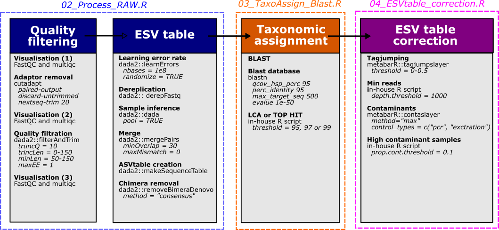

Metabarcoding PPO-BDA
================

**Main author:** Christelle Leung  
**Affiliation:** Fisheries and Oceans Canada (DFO)  
**Group:** Laboratory of genomics  
**Location:** Maurice Lamontagne Institute  
**Affiliated publication:**  
**Contact:** e-mail: <christelle.leung@uqtr.ca>

- [Objective](#objective)
- [Summary](#summary)
- [Status](#status)
- [Contents](#contents)
- [Methods](#methods)
- [Requirements](#requirements)

## Objective

Biodiversity characterization using eDNA - Metagenomics

## Summary

Environmental DNA (eDNA) has become a widely used tool for monitoring
aquatic biodiversity, offering a non-invasive alternative to traditional
survey methods. Its application in dynamic marine environment remains
challenged by uncertainties surrounding the spatial behaviour and
persistence of eDNA molecules. Physical factors can shape distribution
of eDNA, and studies indicate that the spatial scale of DNA dispersal
can varies considerably, potentially confounding biological signals with
hydrodynamic noise. We addressed this challenge by investigating the
spatial structuring of taxonomic diversity using eDNA across three
geographical scales (125, 30, and 1 km ranges) and three metabarcoding
assays (COI, MiFish-U, 16Schord) targeting a broad range of marine taxa.
By integrating environmental variables and applying 3D spatial
autocorrelation analyses, we aimed to disentangle the biological signal
from physical dispersion effects and showed that community compositions
were correlated to environmental and spatiotemporal variables including
sampling location, depth, salinity, temperature, and season. eDNA
detection variation was associated to the combination of these factors,
rather than each factor taken individually. The strength and scale of
these correlations differed among metabarcoding assays. The COI assay,
targeting microalgae and invertebrates, showed the strongest correlation
with factors than the two assays targeting Chordates. The Operational
Taxonomic Unit composition was similar over relatively small scales (\<
150 m) and varied per season. Our results confirm that eDNA is a
powerful tool for characterizing marine communities at fine spatial
scales, with detection reflecting local assemblages withing hundreds of
meters, and even smaller scales during hydrodynamics period such as
spring. This study also provides guidance for optimizing eDNA sampling
strategies to capture biodiversity in heterogenous and dynamic marine
environments.

## Status

Submited

## Contents

### Folder structure

    .
    ├── 00_Data                 # Main datasets  
    ├── 01_Code                 # Scripts for the different analysis
    ├── 02_Results              # Figures and main output results
    ├── README.md
    └── README.Rmd              

The metadata used in this project included several sub‑projects, some of
which contained sequences generated with additional metabarcoding assays
(ex. 12S248). For the present study, we focused on three metabarcoding
assays: COI, MiFish‑U, and 16S-chord, derived from the following
sub‑projects:

- Broad and fine spatial scales:

  - PPO.Leim.VRoy.2019
  - PPO.KMcGregor.2020
  - PPO.Godbout.2021

- Intermediate scale:

  - BDA

All datasets generated and analyzed in this study are publicly available
under the NCBI BioProject accession number PRJNA1435055.

Bioinformatic Workflow The first steps of the bioinformatic processing
were performed using an in‑house R pipeline (v0.2.3), available on
GitHub: <https://github.com/GenomicsMLI-DFO/MLI_metabar_pipeline>

Corrected ESV tables were then copied into the
00_Data/00_ESVs_Corrected/ directory of this repository.

From these files:

- Data cleaning and taxonomic filtering were performed, including
  comparisons of detected taxa with a regional species list, using:

  - 00_format_ESVs_tables.R
  - 00_Format_metaDAta.R

- Map generation for the manuscript was completed using:

  - 01_Map_Metadata.R

- Clustering of ESVs into OTUs was conducted using:

  - 02_ESVs_to_OTUs.R

- Statistical analyses were carried out using scripts 03 to 06.

## Methods

Metagenomics - using four markers, namely COI, MiFishU and 16Schord

### 1) ESVs table and MOTUs information

ESVs table and MOTUs information were obtained by previsously runing MLI
metabarcoding pipeline by Audrey Bourret. Briefly,

### 2) Data transformation

As proposed by G. Guénard, Hellinger-Mahalanobis transformation

### 3) Statistical analysis

- Spatial autocorrelation
- RDA based analysis

## Requirements

The list of required packages for each script is provided at the
beginning of the corresponding file.

*This github readme was generated by knitting the README.Rmd from
Rstudio.*
